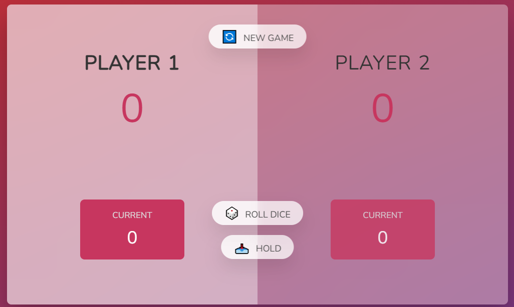
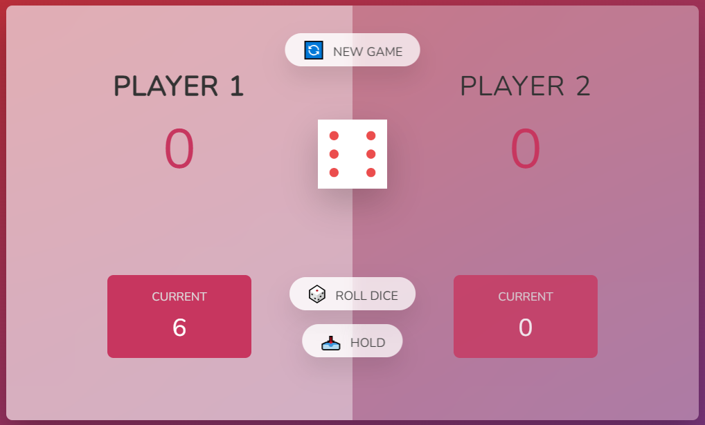
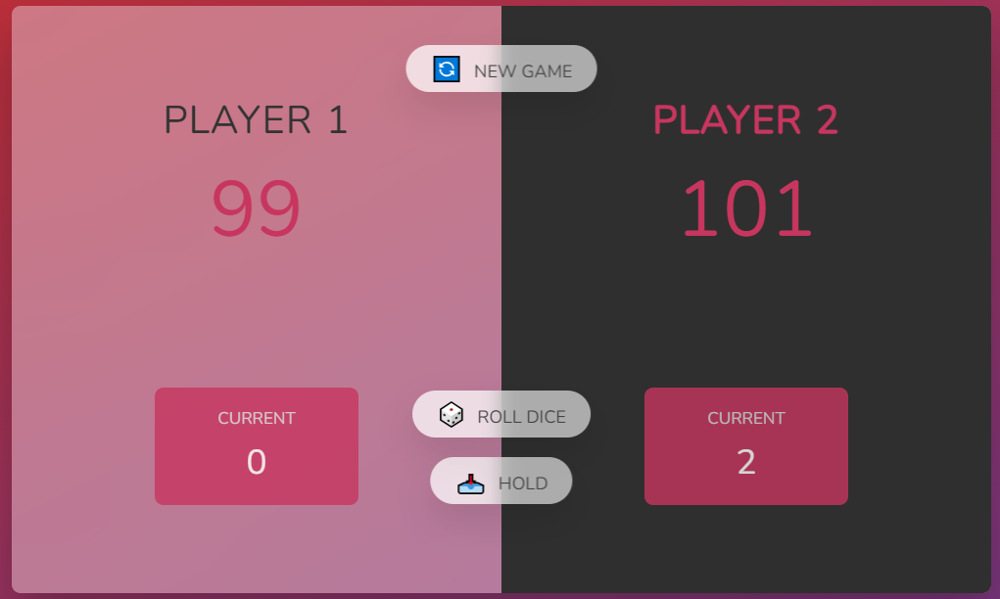

<h1 align="center">🎲 DICE GAME </h1>
<h2>Jonas Schmedtmann eşliğinde  oluşturduğum bu eğlenceli oyunu keşfedin </h2>
<h2>Hakkında:</h2>
✨ 2 oyuncu ile oynanan zevkli mini oyun projesidir. Tüm cihazlarla uyumlu yapıdadır (responsive). 
 Sırası gelen oyuncu zar atarak oyuna başlar.  
 Eğer oyuncu 1 rakamı dışında herhangi bir rakam atarsa istediği kadar zar atabilir ve bu rakamlar currentte toplanır. Hold butonu yardımıyla score a eklenir. 
 Eğer oyuncu 1 rakamını atarsa sıra diğer oyuncuya geçer ve current deki topladığı puanlar sıfırlanır. 
 Score da minimum 101 puana erişen ilk oyuncu oyunu kazanır. 

<h3>🔴Projenin deploy edilmiş versiyonu : <a href="https://dice-game-betul.netlify.app/">Dice Game</a></h3>
 
<h2> 🛠 Kullandığım teknolojiler:</h2>

<h2> GÖRSELLER :</h2>

